**Update (March 4, 2017):** Tutorial updated for Swift 3 and Xcode 8.2.1.

This tutorial will walk you through writing a Mac Menu Bar (aka Status Bar) app, using [Swift](https://developer.apple.com/swift/). We'll build a simple weather app using data from [OpenWeatherMap](http://openweathermap.org/). In the end, it will look like this:

The complete code can be found at <https://github.com/bgreenlee/WeatherBar>.

## What's a Menu Bar App and Why Would I Want to Write One?

Technically, they're Status Bar apps, but most people outside of Apple will refer to them as Menu Bar apps.



Menu Bar apps are great for creating quick utilities. Because the UI is fairly constrained, they are easy to design and create. They're especially well-suited for processes that run in the background, or for quick reference.

## Prerequisites

You should have the latest stable version of [Xcode](https://itunes.apple.com/us/app/xcode/id497799835?mt=12). At the time of this writing, that is 8.2.1. As Swift is a language still under heavy development, it's not unlikely that the code written here may fail to compile on earlier or later versions. I'll try to keep this up-to-date, but if you find any errors, please [create an issue](https://github.com/bgreenlee/WeatherBar/issues).

## Let's Get Something Running

Open Xcode.

Create a New Project or *File ⟶ New ⟶ Project*

Under "Choose a template for your new project", select "macOS", and then in the Application section, select "Cocoa." Click Next.

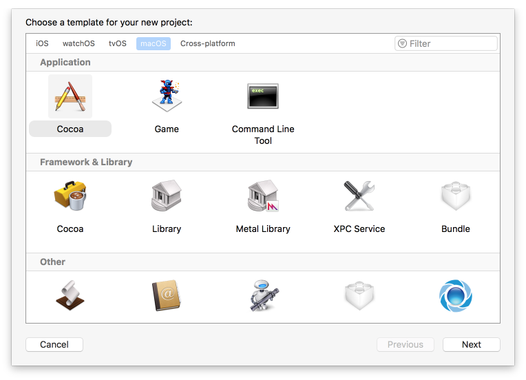

Product Name: *WeatherBar*, Language *Swift*, make sure *Use Storyboards* is unchecked. Team, organization name and identifier are not important at this stage. Make something up if you like. You can check "Include Unit Tests" and "Include UI Tests" if you want, but we won't be covering those in this tutorial.

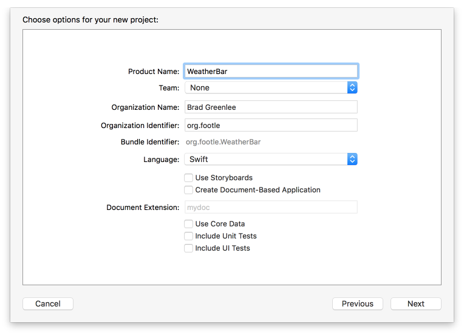

Hit next and save somewhere.

### Let's Code!

Click on *MainMenu.xib* in the sidebar.

Under Objects, delete the default window and menu.

Note: if you don't Main Menu and Window in the second pane from the left, make that pane wider by dragging the right side of it to the right.

Go to the Object Library (right-hand pane, on the bottom; if it isn't showing, go to the menu item View ⟶ Utilities ⟶ Show Object Library, or hit ⌃⌥⌘3). Type "menu" and drag a *Menu* object over to your Objects list, under Font Manager.

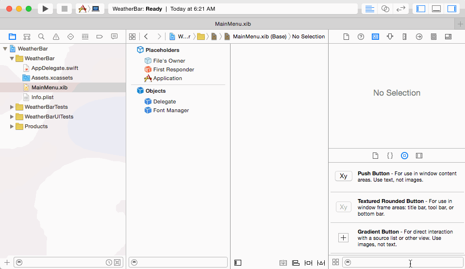

Delete all but one menu item.

Rename the last menu item to *Quit*.

Open the Assistant Editor (⌥⌘↩); this lets us have the Interface Builder and our code side-by-side (if you're a bit cramped for space, you can toggle the Utilities pane on the far right by hitting ⌥⌘0). Make sure *AppDelegate.swift* is in the right-hand pane.

Hold down the control key and drag from your Menu object over to the code, just above or below where it says `@IBOutlet weak var window: NSWindow!`. "Insert Outlet" will appear. Let go and a dialog will pop up asking you to name the outlet. Call it `statusMenu` and hit Connect.

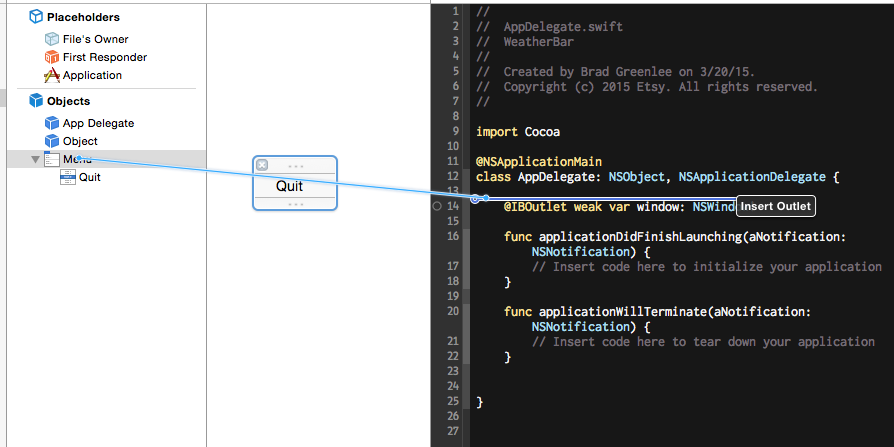

Do the same for the *Quit* menu item, control-dragging to the code, but this time create an **action** named `quitClicked` **action**, with the type set to *NSMenuItem*.

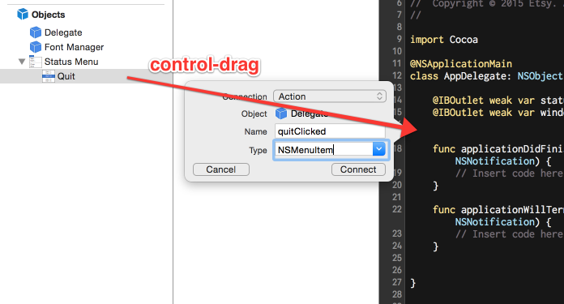

Delete the `@IBOutlet weak var window: NSWindow!` line. We don't need it.

In *AppDelegate.swift*, under `statusMenu`, add:

~~~ swift
let statusItem = NSStatusBar.system().statusItem(withLength: NSVariableStatusItemLength)
~~~

In `applicationDidFinishLaunching`, add:

~~~ swift
statusItem.title = "WeatherBar"
statusItem.menu = statusMenu
~~~

And in `quitClicked`:

~~~ swift
NSApplication.shared().terminate(self)
~~~

Your code should now look like:

~~~ swift
import Cocoa

@NSApplicationMain
class AppDelegate: NSObject, NSApplicationDelegate {

    @IBOutlet weak var statusMenu: NSMenu!

    let statusItem = NSStatusBar.system().statusItem(withLength: NSVariableStatusItemLength)

    @IBAction func quitClicked(sender: NSMenuItem) {
        NSApplication.shared().terminate(self)
    }

    func applicationDidFinishLaunching(aNotification: NSNotification) {
        statusItem.title = "WeatherBar"
        statusItem.menu = statusMenu
    }

    func applicationWillTerminate(aNotification: NSNotification) {
        // Insert code here to tear down your application
    }

}
~~~

Run it! Hit ⌘R or Product ⟶ Run. You now have a working menu bar app.

## Make it Look Like a Real Menu Bar App

You might have noticed an icon shows up in your Dock when you ran your app. You also get the default application menus on the left side of the status bar. Menu bar apps don't need either of those, so let's get rid of them.

Click the application name in the navigator on the left side, then Info in the center pane.

Under *Custom OS X Application Target Properties*, add new property (click on the any property and then on the + that appears).

Type "Application is agent (UIElement)" and set the value to YES.

Run it again and you'll see the Dock icon and default menus are gone.

### Create an Icon

For the icon that goes in the status bar, you need two versions, one 18x18 , and one 2x version at 36x36 .

Click _Assets.xcassets_ in the left sidebar, then the plus button on the bottom of the next panel to the right, and select _New Image Set_. Name the image set "statusIcon" and drag the icons into the 1x and 2x boxes (you can drag them straight from your browser into Xcode).

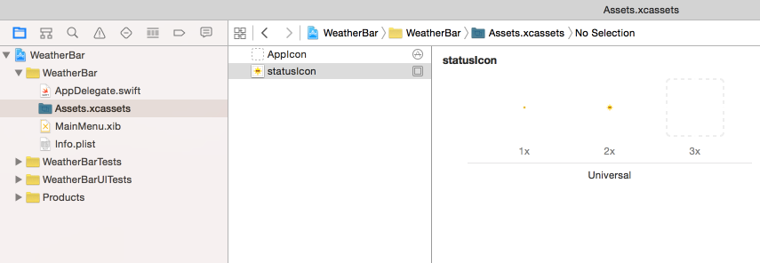

In `applicationDidFinishLaunching`, add:

~~~ swift
let icon = NSImage(named: "statusIcon")
icon?.isTemplate = true // best for dark mode
statusItem.image = icon
statusItem.menu = statusMenu
~~~

Delete the `statusItem.title` line.

Try running it again. We have an icon!

You're probably wondering why the icon that shows up is just a black version of our nice yellow sun. Try commenting out the `icon?.isTemplate = true` line and running it again. Boom! Cool yellow sun.

You'll notice that most, if not all, the icons in your status bar are black. The reason Apple prefers this is to make them work better in dark mode. Go to your System Preferences, General, and you'll see a checkbox at the top for "Use dark menu bar and Dock". Try checking it.

Turns out our sun icon actually looks better in dark mode than in normal mode. It's really your call whether you want the black & white version or the color version. Just know that Apple prefers you use the boring version.

## Reorganize

Before we add more code, we should find a better place to put it. The AppDelegate is really meant to be used only for handling application lifecycle events. We *could* dump all our code in there, but at some point you're going to hate yourself.

Create a controller for the status menu: File ⟶ New File ⟶ macOS Source ⟶ Cocoa Class ⟶ Next

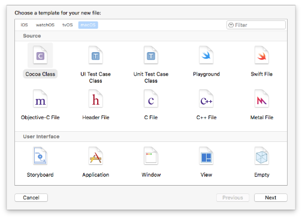

Name the class "StatusMenuController", with a subclass of _NSObject_. Hit next and create. Now let's move over the following code from the AppDelegate. Rename the `applicationDidFinishLaunching` method to `override func awakeFromNib()`. The StatusMenuController should look like:

~~~ swift
// StatusMenuController.swift

import Cocoa

class StatusMenuController: NSObject {
    @IBOutlet weak var statusMenu: NSMenu!

     let statusItem = NSStatusBar.system().statusItem(withLength: NSVariableStatusItemLength)

    override func awakeFromNib() {
        let icon = NSImage(named: "statusIcon")
        icon?.isTemplate = true // best for dark mode
        statusItem.image = icon
        statusItem.menu = statusMenu
    }

    @IBAction func quitClicked(sender: NSMenuItem) {
        NSApplication.shared().terminate(self)
    }
}
~~~

Remove the above code from AppDelegate. It should now look the same as when we first started, minus the `window` var.

~~~ swift
// AppDelegate.swift

import Cocoa

@NSApplicationMain
class AppDelegate: NSObject, NSApplicationDelegate {
    func applicationDidFinishLaunching(aNotification: NSNotification) {
        // Insert code here to initialize your application
    }
    func applicationWillTerminate(aNotification: NSNotification) {
        // Insert code here to tear down your application
    }
}
~~~

Unfortunately, when you move code that was connected to UI elements (such as `statusItem` and `quitClicked`), Xcode loses the connection, so we'll need to reconnect them.

First, though, we need to make sure that our StatusMenuController gets loaded when MainMenu.xib gets loaded. To do that, we need to add it as an Object in the XIB.

Click on _MainMenu.xib_. Open the Object Library again, and type "object", and then drag an Object over to just above Status Menu.

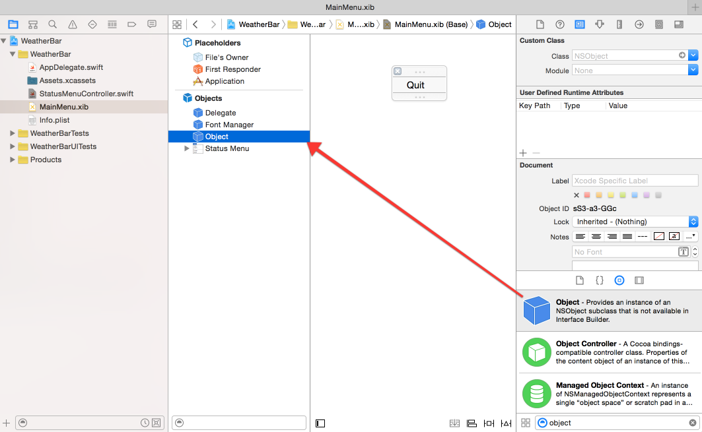

Click on the Object, select the Identity Inspector (⌥⌘3), and enter "StatusMenuController" in the Class field.

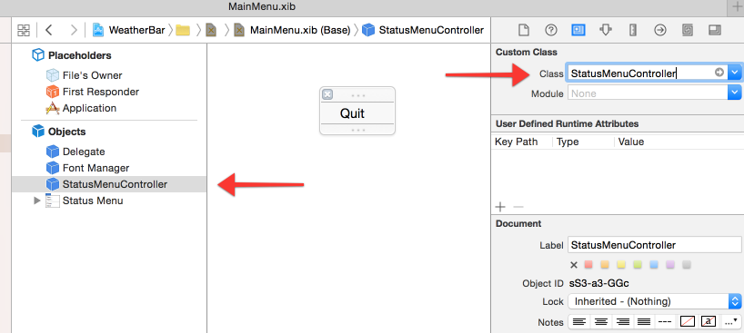

Right-click on the _StatusMenuController_ object, and under Outlets, drag the circle next to _statusMenu_ over to your Menu object.

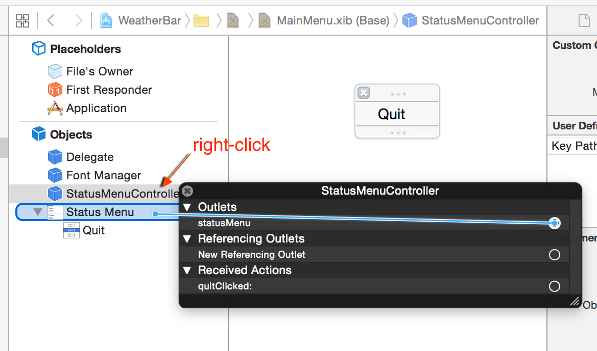

Do that again for the _quitClicked_ action, going to your Quit menu item.

Finally, right-click on the _Delegate_ object and click the X next to the statusMenu outlet to clear that association.

Now, when the application is launched and the _MainMenu.xib_ is instantiated, our StatusMenuController will receive `awakeFromNib`, and we can do what we need to initialize the status menu.

Run it again to make sure it still works.

## Calling the API

Time to get some actual weather data. We're going to use [OpenWeatherMap](http://openweathermap.org/). You'll need to [create an account](http://home.openweathermap.org/users/sign_up) to get your free API key.

The next thing we need is something to manage communication with the weather API.

File ⟶ New File ⟶ macOS Source ⟶ Swift File ⟶ WeatherAPI.swift, and add the following, **making sure you insert your API key**.

~~~ swift
import Foundation

class WeatherAPI {
    let API_KEY = "your-api-key-here"
    let BASE_URL = "http://api.openweathermap.org/data/2.5/weather"

    func fetchWeather(_ query: String) {
        let session = URLSession.shared
        // url-escape the query string we're passed
        let escapedQuery = query.addingPercentEncoding(withAllowedCharacters: CharacterSet.urlQueryAllowed)
        let url = URL(string: "\(BASE_URL)?APPID=\(API_KEY)&units=imperial&q=\(escapedQuery!)")
        let task = session.dataTask(with: url!) { data, response, err in
            // first check for a hard error
            if let error = err {
                NSLog("weather api error: \(error)")
            }

            // then check the response code
            if let httpResponse = response as? HTTPURLResponse {
                switch httpResponse.statusCode {
                case 200: // all good!
                    if let dataString = String(data: data!, encoding: .utf8) {
                        NSLog(dataString)
                    }
                case 401: // unauthorized
                    NSLog("weather api returned an 'unauthorized' response. Did you set your API key?")
                default:
                    NSLog("weather api returned response: %d %@", httpResponse.statusCode, HTTPURLResponse.localizedString(forStatusCode: httpResponse.statusCode))
                }
            }
        }
        task.resume()
    }
}
~~~

Now we need a way to call this. We could just stick a call in _AppDelegate_ or `StatusMenuController#awakeFromNib`, but let's be a little less lazy and add a menu item to call it.

In _MainMenu.xib_, type "Menu Item" into the Object Library search field (bottom right), and drag a Menu Item over to above Quit in your menu. While we're at it, drag a Separator Menu Item between those two. Rename the new menu item "Update".

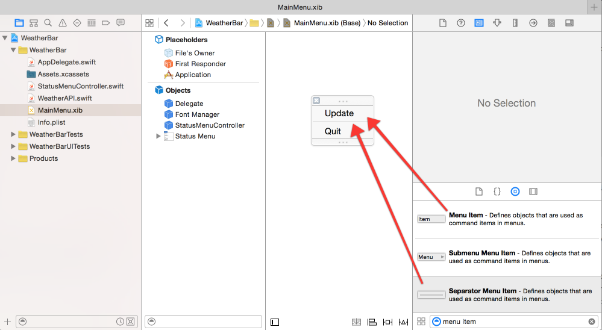

Open the Assistant Editor with _StatusMenuController.swift_ and ctrl-drag from Update over to your code above `quitClicked` and create a new action, `updateClicked`, with the type again as _NSMenuItem_.

We need to instantiate _WeatherAPI_, so in _StatusMenuController_ at the top, under `let statusItem` add:

~~~ swift
let weatherAPI = WeatherAPI()
~~~

and in `updateClicked`, add:

~~~ swift
weatherAPI.fetchWeather("Seattle")
~~~

Run it, and select Update. If you are running OS X 10.11 (El Capitan) or later, you will see an error in your console: `The resource could not be loaded because the App Transport Security policy requires the use of a secure connection.` This is because OpenWeatherMap only provides (as of this writing) a non-SSL (http) endpoint, and El Capitan introduced a security measure that prevents connections to non-SSL endpoints without an explicit exception. To get past this, we need to add the exception to our _Info.plist_ file.

This will be easier to do (and explain) by editing the raw XML of the _Info.plist_ file directly, instead of using the properties editor. So *right-click* on _Info.plist_ and select Open As ⟶ Source Code:

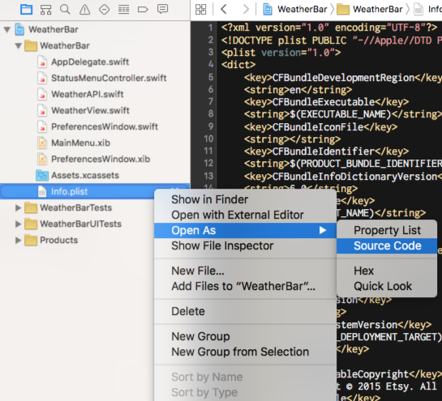

At the bottom, before the last `</dict>`, add:

~~~ xml
<key>NSAppTransportSecurity</key>
<dict>
    <key>NSExceptionDomains</key>
    <dict>
        <key>api.openweathermap.org</key>
        <dict>
            <key>NSExceptionAllowsInsecureHTTPLoads</key>
            <true/>
        </dict>
    </dict>
</dict>
~~~

Save, run again, and select Update. You should see the JSON response in the console.

Now, you probably want it to fetch the weather as soon as the app launches. Let's reorganize `StatusMenuController` a bit, adding an `updateWeather` method. Here's what it looks like now:

~~~ swift
import Cocoa

class StatusMenuController: NSObject {
    @IBOutlet weak var statusMenu: NSMenu!

    let statusItem = NSStatusBar.system().statusItem(withLength: NSVariableStatusItemLength)
    let weatherAPI = WeatherAPI()

    override func awakeFromNib() {
        statusItem.menu = statusMenu
        let icon = NSImage(named: "statusIcon")
        icon?.isTemplate = true // best for dark mode
        statusItem.image = icon

        updateWeather()
    }

    func updateWeather() {
        weatherAPI.fetchWeather("Seattle")
    }

    @IBAction func updateClicked(_ sender: NSMenuItem) {
        updateWeather()
    }

    @IBAction func quitClicked(sender: NSMenuItem) {
        NSApplication.shared().terminate(self)
    }
}
~~~

## Parsing JSON

Parsing JSON is a little awkward in Swift, and people have written libraries–like [SwiftyJSON](https://github.com/SwiftyJSON/SwiftyJSON)–to make this easier, but our needs are simple and I don't want to complicate things with installing external libraries (although if you do, the two main package managers for Xcode are [Carthage](https://github.com/Carthage/Carthage) and [CocoaPODS](http://cocoapods.org/)).

Here's the [prettified] JSON returned by OpenWeatherMap:

~~~ json
{
    "coord": {
        "lon": -122.33,
        "lat": 47.61
    },
    "weather": [{
        "id": 800,
        "main": "Clear",
        "description": "sky is clear",
        "icon": "01n"
    }],
    "base": "cmc stations",
    "main": {
        "temp": 57.45,
        "pressure": 1018,
        "humidity": 59,
        "temp_min": 53.6,
        "temp_max": 62.6
    },
    "wind": {
        "speed": 2.61,
        "deg": 19.5018
    },
    "clouds": {
        "all": 1
    },
    "dt": 1444623405,
    "sys": {
        "type": 1,
        "id": 2949,
        "message": 0.0065,
        "country": "US",
        "sunrise": 1444659833,
        "sunset": 1444699609
    },
    "id": 5809844,
    "name": "Seattle",
    "cod": 200
}
~~~

There's a lot of information we could use here, but for now let's keep it simple and just take the city name, current temperature, and the weather description. Let's first create a place to put the weather data. In _WeatherAPI.swift_, add a struct at the top of the file:

~~~ swift
struct Weather {
    var city: String
    var currentTemp: Float
    var conditions: String
}
~~~

Now, in the _WeatherAPI_ class, add a function to parse the incoming JSON data and return a Weather object:

~~~ swift
func weatherFromJSONData(_ data: Data) -> Weather? {
    typealias JSONDict = [String:AnyObject]
    let json : JSONDict

    do {
        json = try JSONSerialization.jsonObject(with: data, options: []) as! JSONDict
    } catch {
        NSLog("JSON parsing failed: \(error)")
        return nil
    }

    var mainDict = json["main"] as! JSONDict
    var weatherList = json["weather"] as! [JSONDict]
    var weatherDict = weatherList[0]

    let weather = Weather(
        city: json["name"] as! String,
        currentTemp: mainDict["temp"] as! Float,
        conditions: weatherDict["main"] as! String
    )

    return weather
}
~~~

We return an _Optional(Weather)_ because it's possible the JSON may fail to parse.

Now, change the `fetchWeather` function to call `weatherFromJSONData` (lines 11-13):


let task = session.dataTask(with: url!) { data, response, err in
    // first check for a hard error
    if let error = err {
        NSLog("weather api error: \(error)")
    }

    // then check the response code
    if let httpResponse = response as? HTTPURLResponse {
        switch httpResponse.statusCode {
        case 200: // all good!
            if let weather = self.weatherFromJSONData(data!) {
                NSLog("\(weather)")
            }
        case 401: // unauthorized
            NSLog("weather api returned an 'unauthorized' response. Did you set your API key?")
        default:
            NSLog("weather api returned response: %d %@", httpResponse.statusCode, HTTPURLResponse.localizedString(forStatusCode: httpResponse.statusCode))
        }
    }
}


If you run it now, you'll see something like this:

~~~
2015-03-19 14:58:00.758 WeatherBar[49688:1998824] Optional(WeatherBar.Weather(city: "Seattle", currentTemp: 51.6, conditions: "Clouds"))
~~~

We can make that output a little neater by implementing the [CustomStringConvertible](https://developer.apple.com/library/prerelease/ios/documentation/Swift/Reference/Swift_CustomStringConvertible_Protocol/index.html) protocol, which just entails adding a `description`. Change your _Weather_ struct to:

~~~ swift
struct Weather: CustomStringConvertible {
    var city: String
    var currentTemp: Float
    var conditions: String

    var description: String {
        return "\(city): \(currentTemp)F and \(conditions)"
    }
}
~~~

If you run it again now you'll see:

~~~
2017-03-01 06:13:48.255 WeatherBar[68094:14793691] Seattle: 51.6F and Clouds
~~~

## Getting the Weather into the Controller

Next, let's actually display the weather in our app, as opposed to in the debug console.

First we have the problem of how we get the weather data back into our controller, so we can in turn insert it into the menu. The weather API call is asynchronous, so we can't just call `weatherAPI.fetchWeather()` and expect a Weather object in return.

There are two common ways to handle asynchronous responses: delegates and callbacks.  Up until recently, delegates were the most common pattern in MacOS and iOS programming. I'll describe how that would work in the next section. **Feel free to just read along, rather than implement, as our final code will use a callback.**

### Delegate Implementation

Add the following above `class WeatherAPI` in **WeatherAPI.swift**:

~~~ swift
protocol WeatherAPIDelegate {
    func weatherDidUpdate(_ weather: Weather)
}
~~~

Add the following class variable to the WeatherAPI class, below `let BASE_URL = ...`:

~~~ swift
var delegate: WeatherAPIDelegate?
~~~

Add an initializer fuction below that:

~~~ swift
init(delegate: WeatherAPIDelegate) {
    self.delegate = delegate
}
~~~

And now the data fetch task in `fetchWeather` will look like this (line 12 below):


let task = session.dataTask(with: url!) { data, response, err in
    // first check for a hard error
    if let error = err {
        NSLog("weather api error: \(error)")
    }

    // then check the response code
    if let httpResponse = response as? HTTPURLResponse {
        switch httpResponse.statusCode {
        case 200: // all good!
            if let weather = self.weatherFromJSONData(data!) {
                self.delegate?.weatherDidUpdate(weather)
            }
        case 401: // unauthorized
            NSLog("weather api returned an 'unauthorized' response. Did you set your API key?")
        default:
            NSLog("weather api returned response: %d %@", httpResponse.statusCode, HTTPURLResponse.localizedString(forStatusCode: httpResponse.statusCode))
        }
    }
}


Finally, we implement the `WeatherAPIDelegate` protocol in the _StatusMenuController_, with a few changes noted:

~~~ swift
class StatusMenuController: NSObject, WeatherAPIDelegate {
...
  var weatherAPI: WeatherAPI!

  override func awakeFromNib() {
    ...
    weatherAPI = WeatherAPI(delegate: self)
    updateWeather()
  }
  ...
  func weatherDidUpdate(_ weather: Weather) {
    NSLog(weather.description)
  }
  ...
~~~

### Callback Implementation

With the introduction of blocks to Objective-C, and Swift's first-class functions, a simpler way is to use callbacks. (If you implemented the delegate changes above, go ahead and back them out first.)

First, let's change the function definition of the `fetchWeather` method in _WeatherAPI.swift_ to accept a callback function:

~~~ swift
func fetchWeather(_ query: String, success: @escaping (Weather) -> Void) {
~~~

This says we expect a function which takes a Weather object as a parameter and returns nothing (Void). We need the `@escaping` because we're going to be using that function to call out of `fetchWeather`. For more information see [Escaping Closures](https://developer.apple.com/library/prerelease/content/documentation/Swift/Conceptual/Swift_Programming_Language/Closures.html#//apple_ref/doc/uid/TP40014097-CH11-ID546) in The Swift Programming Language documentation.

Change the data-fetching task in`fetchWeather` to look like this (line 12):


let task = session.dataTask(with: url!) { data, response, err in
    // first check for a hard error
    if let error = err {
        NSLog("weather api error: \(error)")
    }

    // then check the response code
    if let httpResponse = response as? HTTPURLResponse {
        switch httpResponse.statusCode {
        case 200: // all good!
            if let weather = self.weatherFromJSONData(data!) {
                success(weather)
            }
        case 401: // unauthorized
            NSLog("weather api returned an 'unauthorized' response. Did you set your API key?")
        default:
            NSLog("weather api returned response: %d %@", httpResponse.statusCode, HTTPURLResponse.localizedString(forStatusCode: httpResponse.statusCode))
        }
    }
}


In our controller:

~~~ swift
func updateWeather() {
    weatherAPI.fetchWeather("Seattle, WA") { weather in
        NSLog(weather.description)
    }
}
~~~

Run it to verify that it still works.

Aside: In Swift, if the last parameter of a method is a function, you can use the above block syntactic sugar. It is the same as doing:

~~~ swift
weatherAPI.fetchWeather("Seattle, WA", success: { weather in NSLog(weather.description)})
~~~

## Displaying the Weather

Finally, we'll update our menu to display the weather.

In _MainMenu.xib_, add a new MenuItem between Update and Quit (and another separator) and rename it "Weather".

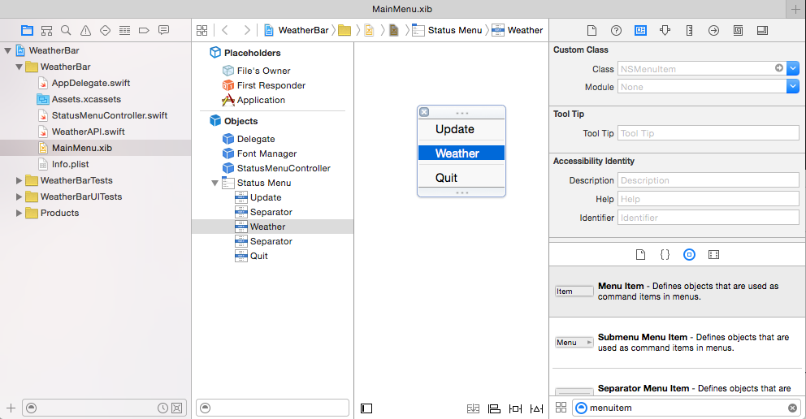

In your controller, in `updateWeather`, replace the `NSLog` with:

~~~ swift
if let weatherMenuItem = self.statusMenu.item(withTitle: "Weather") {
    weatherMenuItem.title = weather.description
}
~~~

Run and voila!

The weather is greyed out because we have no action associated with selecting it. We could have it open a web page to a detailed forecast, but instead next we'll make a nicer display.

## Creating a Weather View

Open MainMenu.xib.

Drag a Custom View onto the page.

Drag a Image View into the upper left corner of the view, and in the Image View's Size Inspector (⌥⌘5), set the width and height to 50.

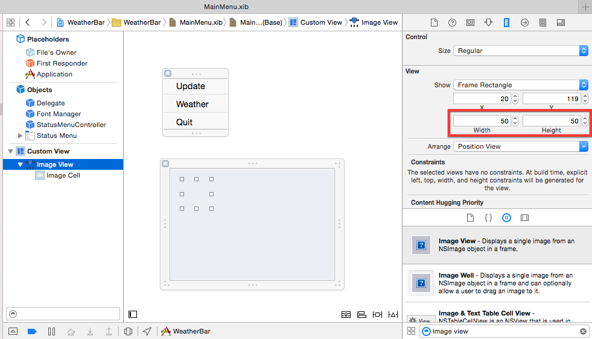

Add Labels for city and current temperature/conditions (we'll use one label for both temperature and conditions).

Adjust the view size down to about 265 x 90 (you can set that in the Custom View's Size Inspector). It should look roughly like this:

New File ⟶ macOS Source ⟶ Cocoa Class, name it WeatherView and make it a subclass of NSView, and save. The file will contain a stub `drawRect` method which you can delete.

Back in MainMenu.xib, click on the Custom View, and in the Identity Inspector (⌥⌘3), set the class to "WeatherView".

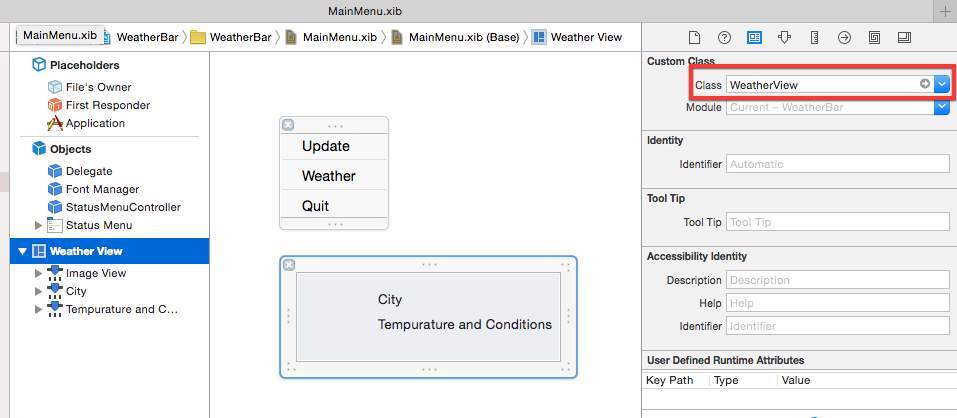

Now use the Assistant Editor (⌥⌘↩) to bring up the xib and class file side-by-side, and then ctrl-drag from the xib to create outlets for each of the elements in the view. WeatherView.swift should look like:

~~~ swift
import Cocoa

class WeatherView: NSView {
    @IBOutlet weak var imageView: NSImageView!
    @IBOutlet weak var cityTextField: NSTextField!
    @IBOutlet weak var currentConditionsTextField: NSTextField!
}
~~~

Now add a method to WeatherView so we can update it with a Weather object:

~~~ swift
func update(_ weather: Weather) {
    // do UI updates on the main thread
    DispatchQueue.main.async {
        self.cityTextField.stringValue = weather.city
        self.currentConditionsTextField.stringValue = "\(Int(weather.currentTemp))°F and \(weather.conditions)"
    }
}
~~~

(The reason we use `DispatchQueue.main.async` here is that any updates to the UI should be donw on the main thread, and `update` is getting called from a networking thread.) Now bring up StatusMenuController in the Assistant Editor, and ctrl-drag from the Weather View object over to the top of the StatusMenuController class to create a `weatherView` outlet. While we're there, we're going to add a `weatherMenuItem` class var:

~~~ swift
class StatusMenuController: NSObject {
    @IBOutlet weak var statusMenu: NSMenu!
    @IBOutlet weak var weatherView: WeatherView!
    var weatherMenuItem: NSMenuItem!
    ...
~~~

In StatusMenuController's `awakeFromNib` method, before the call to `updateWeather`, add:

~~~ swift
weatherMenuItem = statusMenu.item(withTitle: "Weather")
weatherMenuItem.view = weatherView
~~~

And now `updateWeather` is even simpler:

~~~ swift
func updateWeather() {
    weatherAPI.fetchWeather("Seattle, WA") { weather in
        self.weatherView.update(weather)
    }
}
~~~

Run it!

## Adding the Weather Image

So, we're obviously missing something in our weather view. Let's update it with the appropriate weather image.

The images for the various weather conditions can be found at http://openweathermap.org/weather-conditions, but I've put them in a [zip file](assets/weather-icons.zip) for you. You can just unzip that and drag the whole folder into _Assets.xcassets_.

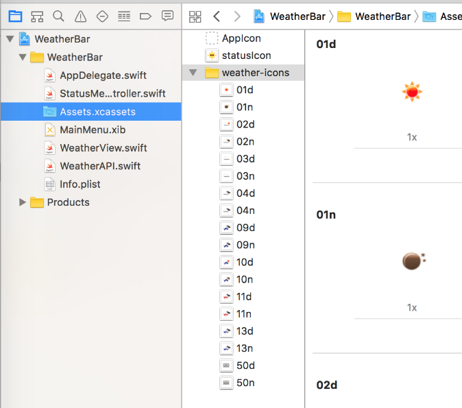

We need to update _WeatherAPI_ to capture the icon code. In the _Weather_ struct in _WeatherAPI.swift_, add:

~~~ swift
var icon: String
~~~

and in `weatherFromJSONData`, add that to the Weather initialization:

~~~ swift
let weather = Weather(
    city: json["name"] as! String,
    currentTemp: mainDict["temp"] as! Float,
    conditions: weatherDict["main"] as! String,
    icon: weatherDict["icon"] as! String
)
~~~

Now in the `update` method of WeatherView, add:

~~~ swift
self.imageView.image = NSImage(named: weather.icon)
~~~

That's it! Run it. Pretty!

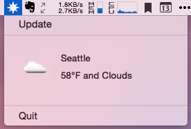

## Preferences

Having the city hard-coded in the app is not cool. Let's make a Preferences pane so we can change it.

Open up _MainMenu.xib_ and drag another MenuItem onto the menu, above Quit, naming it "Preferences...".

Open up the Assistant Editor again with _StatusMenuController_, and ctrl-drag from the Preferences menu item over to the code and create a "preferencesClicked" action (again with type `NSMenuItem`).

New ⟶ File ⟶ macOS Source ⟶ Cocoa Class. Call it "PreferencesWindow", set the subclass to NSWindowController, and check the box to create a XIB file. Save it.

Click on _PreferencesWindow.xib_, and in the Attributes Inspector (⌥⌘4), give the window a title of Preferences. Add a label for "City:", and put a Text Field to the right of it. It should look something like this:

Fancy!

Bring up the Assistant Editor with _PreferencesWindow.swift_ and ctrl-drag from the text field to the code and create an outlet named "cityTextField".

In PreferencesWindow.swift, add:

~~~ swift
override var windowNibName : String! {
    return "PreferencesWindow"
}
~~~

and at the end of `windowDidLoad()`, add:

~~~ swift
self.window?.center()
self.window?.makeKeyAndOrderFront(nil)
NSApp.activate(ignoringOtherApps: true)
~~~

So _PreferencesWindow.swift_ should look like:

~~~ swift
import Cocoa

class PreferencesWindow: NSWindowController {
    @IBOutlet weak var cityTextField: NSTextField!

    override var windowNibName : String! {
        return "PreferencesWindow"
    }

    override func windowDidLoad() {
        super.windowDidLoad()

        self.window?.center()
        self.window?.makeKeyAndOrderFront(nil)
        NSApp.activate(ignoringOtherApps: true)
    }
}
~~~

In _StatusMenuController.swift_, add a `preferencesWindow` class var:

~~~ swift
var preferencesWindow: PreferencesWindow!
~~~

and initialize in `awakeFromNib()`, before the call to `updateWeather()`:

~~~ swift
preferencesWindow = PreferencesWindow()
~~~

Finally, in the `preferencesClicked` function, add:

~~~ swift
preferencesWindow.showWindow(nil)
~~~

If you run now, selecting the Preferences... menu item should bring up the preferences window.

Now, let's actually save and update the city.

Make the PreferencesWindow class an `NSWindowDelegate`:

~~~ swift
class PreferencesWindow: NSWindowController, NSWindowDelegate {
~~~

and add:

~~~ swift
func windowWillClose(_ notification: Notification) {
    let defaults = UserDefaults.standard
    defaults.setValue(cityTextField.stringValue, forKey: "city")
}
~~~

Now we need to notify the `StatusMenuController` that the preferences have been updated. For this we'll use the delegate pattern. This is easy, but requires a number of edits. First, at the top of PreferencesWindow.swift, add a `PreferencesWindowDelegate` protocol:

~~~ swift
protocol PreferencesWindowDelegate {
    func preferencesDidUpdate()
}
~~~

and add a `delegate` instance variable to PreferencesWindow:

~~~ swift
var delegate: PreferencesWindowDelegate?
~~~

Also in PreferencesWindow, at the end of `windowWillClose`, we'll call the delegate:

~~~ swift
delegate?.preferencesDidUpdate()
~~~

Back in StatusMenuController, make it a PreferencesWindowDelegate:

~~~ swift
class StatusMenuController: NSObject, PreferencesWindowDelegate {
~~~

and add the delegate method:

~~~ swift
func preferencesDidUpdate() {
    updateWeather()
}
~~~

And in `awakeFromNib`, set the delegate:

~~~ swift
preferencesWindow = PreferencesWindow()
preferencesWindow.delegate = self
~~~

All that's left is to load the city from defaults. First add this at the top of StatusMenuController, **under the imports**:

~~~ swift
let DEFAULT_CITY = "Seattle, WA"
~~~

(...or whatever you want the default to be.) Yes, this is a global variable, and there are probably better ways to do this (like storing it in Info.plist), but that can be left as an exercise for the reader.

Load the saved city, or default, in `updateWeather`:

~~~ swift
func updateWeather() {
    let defaults = UserDefaults.standard
    let city = defaults.string(forKey: "city") ?? DEFAULT_CITY
    weatherAPI.fetchWeather(city) { weather in
        self.weatherView.update(weather)
    }
}
~~~

Finally, back in PreferencesWindow.swift, we need to add similar code to load any saved city when we show the preferences. At the end of `windowDidLoad`, add:

~~~ swift
let defaults = UserDefaults.standard
let city = defaults.string(forKey: "city") ?? DEFAULT_CITY
cityTextField.stringValue = city
~~~

Run it!

## Next Steps

That's the end of this tutorial. Obviously there's a lot more that we can do with this, but I'll leave that up to you. Some ideas:

### Easy

- Add other weather info (high/low temp, humidity, sunrise/sunset, etc) to the Weather View
- Change the status menu icon + title to reflect the current conditions
- Add a timer to update the weather regularly (hint: `RunLoop.main.add(refreshTimer!, forMode: RunLoopMode.commonModes)`).
- Make it so clicking on the Weather View opens a browser with detailed weather information (hint: `NSWorkspace.shared().open(url: NSURL)`). Note that since we're using a custom view, the menu item isn't highlighted when you mouse over it, so you'll probably want to do something to make it obvious that it is clickable.
- Add some error handling. Right now if we get an unexpected response from the API, for example, bad things will happen.
- [Write some tests!](https://developer.apple.com/library/mac/documentation/DeveloperTools/Conceptual/testing_with_xcode/Introduction/Introduction.html#//apple_ref/doc/uid/TP40014132-CH1-SW1)
- Add an app icon. This isn't hard, but it can be a pain creating the [various sizes that Apple wants](https://developer.apple.com/library/mac/documentation/GraphicsAnimation/Conceptual/HighResolutionOSX/Optimizing/Optimizing.html). Fortunately, there are [tools to make this easier](https://itunes.apple.com/us/app/asset-catalog-creator-app/id809625456?mt=12).
- Add a preference to launch the app on login. I've used the [LaunchAtLoginController](https://github.com/Mozketo/LaunchAtLoginController) library in other apps. There's also [this blog post](http://bdunagan.com/2010/09/25/cocoa-tip-enabling-launch-on-startup/), if you want to try porting the code over to Swift.
- Create an About window.

### More Challenging

- Add support for multiple cities. This will take some effort, especially if the number of cities is dynamic. I think you'll have to put the Weather View in its own XIB, and load it manually (look at `Bundle.main.loadNibNamed(name, owner: owner, options: options)`). The UI in Preferences will obviously need to be updated as well.

### You Know Way More Than Me Now

- Create a completely custom view when clicking on the app in the status bar. See the [Weather Live](https://itunes.apple.com/us/app/weather-live/id755717884?mt=12) app, for example. I haven't tried this, but I suspect it is easier than you might think (depending on how fancy your view is, of course).

## Resources

**[The Swift Programming Language](https://developesur.apple.com/library/ios/documentation/Swift/Conceptual/Swift_Programming_Language/)** - Apple's documentation, also downloadable as a [free iBook](https://itunes.apple.com/us/book/the-swift-programming-language/id881256329?mt=11)

**[Apple's Swift Blog](https://developer.apple.com/swift/blog/)** and **[Swift Resources](https://developer.apple.com/swift/resources/)** - Straight from the source.

**[NSHipster](http://nshipster.com/)** - Tons of great, in-depth articles on Objective-C, Swift, and Cocoa

**[Ray Wenderlich's Tutorials](http://www.raywenderlich.com/tutorials)** - Puts this tutorial to shame.

**[Mike Ash's NSBlog](https://mikeash.com/pyblog/)** - Great deep dives into Objective-C and Swift

## Contact

Got questions, feedback, or corrections? [Hit me up!](mailto:brad@footle.org) (You can also submit and [issue](https://github.com/bgreenlee/WeatherBar/issues) or [pull request](https://github.com/bgreenlee/WeatherBar/pulls).)
